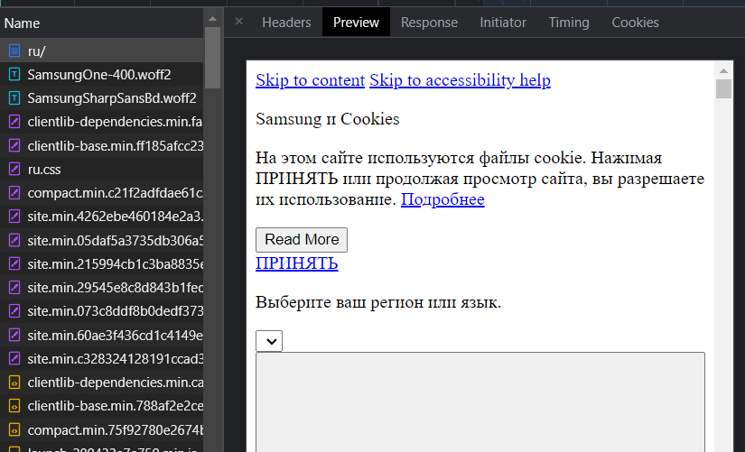
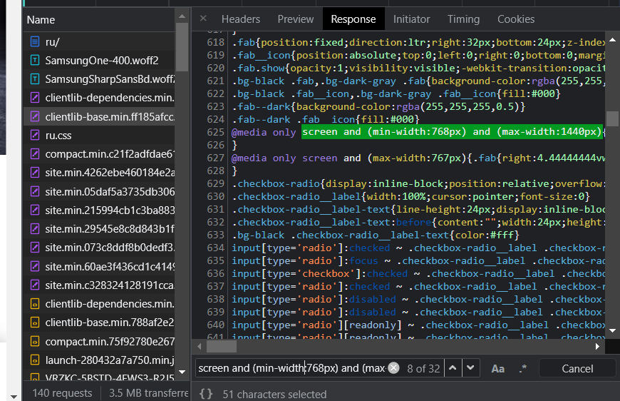
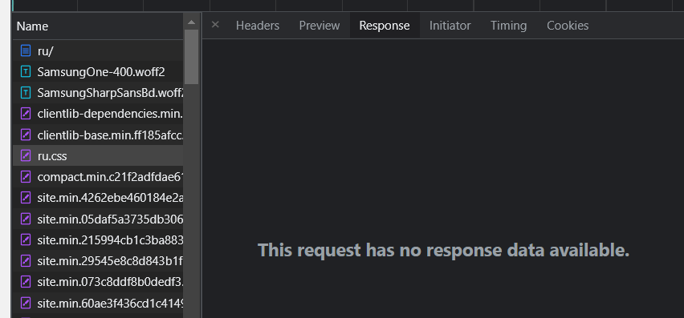
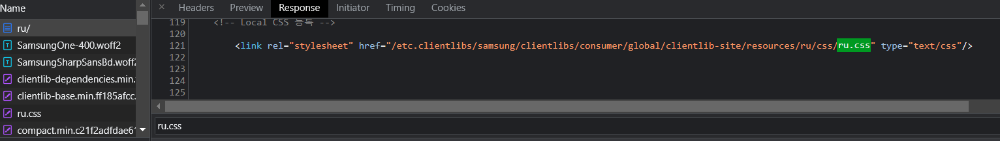
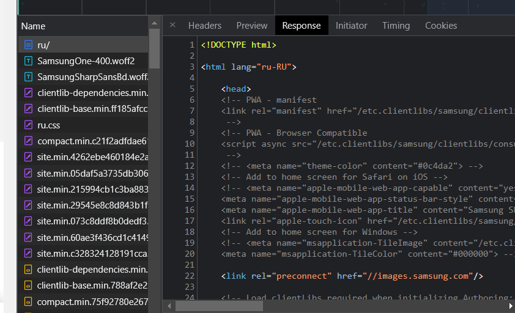
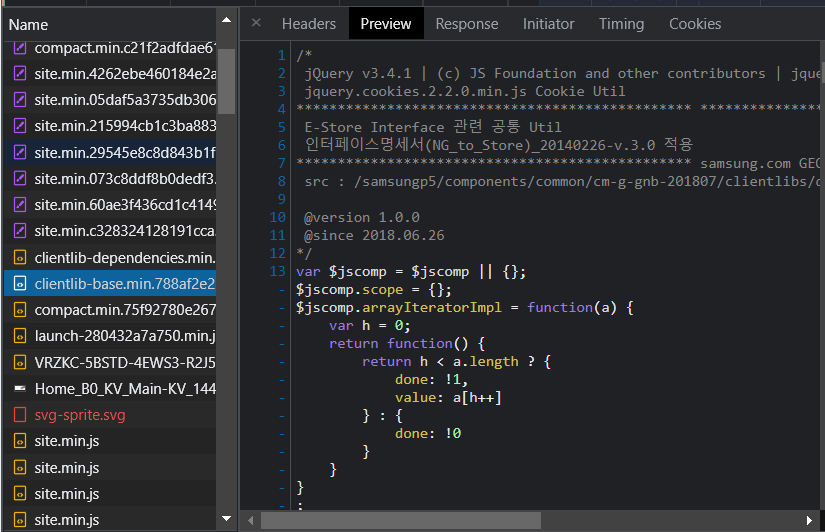
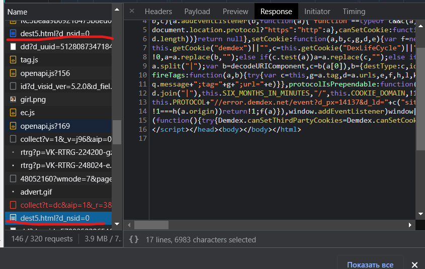
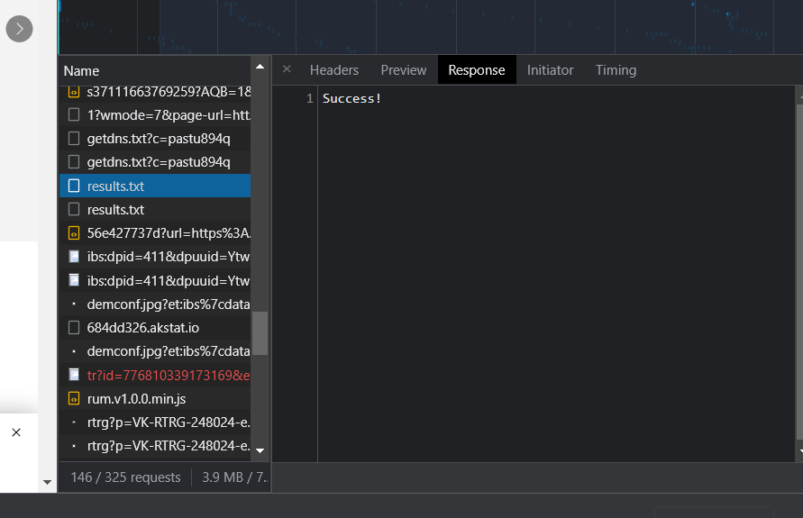
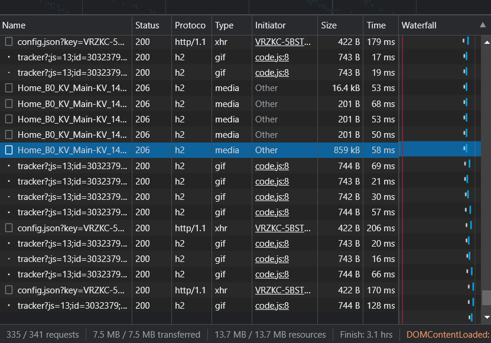

# Производительность сайта

Сайта https://www.samsung.com/ru/


## Network

Вначале приходит голый html. Стоит добавить в него встроенные стили для основных блоков, чтобы не ждать файл со всеми стилями и показать основные части страницы раньше и без миганий



---

Большой css файл с медиа-выражениями (значит правила для разных экранов). Можно было бы, например, добавить в `index.html` скрипт определяющий размер экрана, а после подгружающий нужный css-файл.

Еще, видимо, этот файл с общими стилями для всего сайта и не все стили используются на стартовой странице.



---

Лишний запрос на `ru.css`






---

`index.html` не минифицирован и имеет много комментариев с кодом



---

Используют `JQuery`. И видимо (по названию) это бандл с кодом всего сайта, значит часть этого кода не будет использоваться на главной странице



---

Приходит два одинаковых файла, только из разных доменов




---

Приходят какие-то бесполезные текстовые файлы



---

Приходят видео файлы mp4 маленьких и больший размеров (до 1 МБ).
Может лучше использовать гифку, которую на финише менять на картинку




## Performance

* First Paint (FP) - 348.9 ms
* First Contentful -  Paint (FCP) - 348.9 ms
* Largest Contentful Paint (LCP) - 561.2 ms
* DOM Content Loaded (DCL) - 557.7 ms

Еще есть три Layout shift - прыгающих элемента макета

LCP происходит на узле ``````

* Loading - 31 ms
* Scripting - 988 ms
* Rendering - 422 ms
* Painting - 156 ms


## coverage

* CSS - из 519 КБ не используется 429 КБ (т.е. 83%)
* JS - из 2.5 МБ не используется 1.3 МБ (т.е. 52%)
