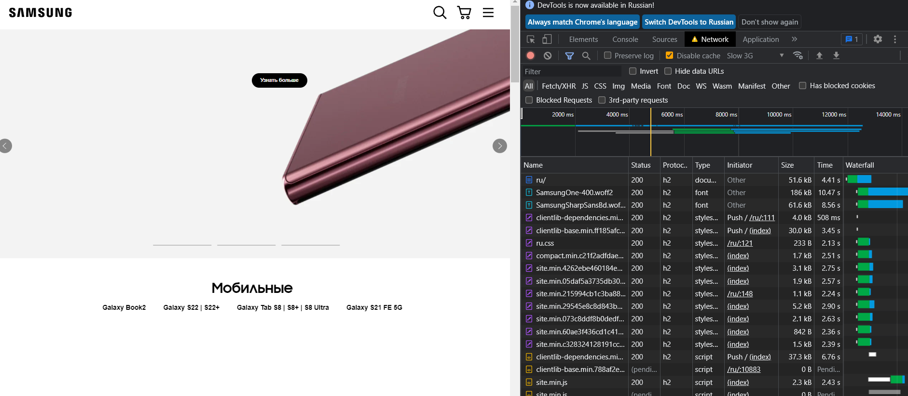
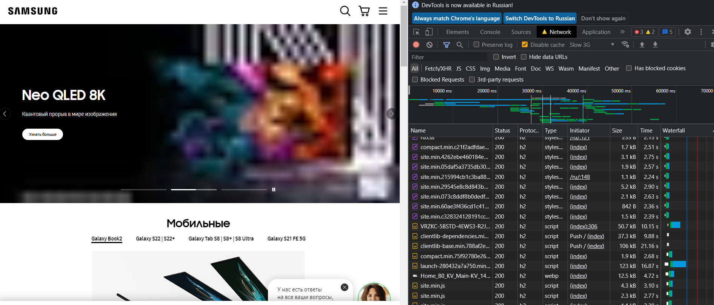
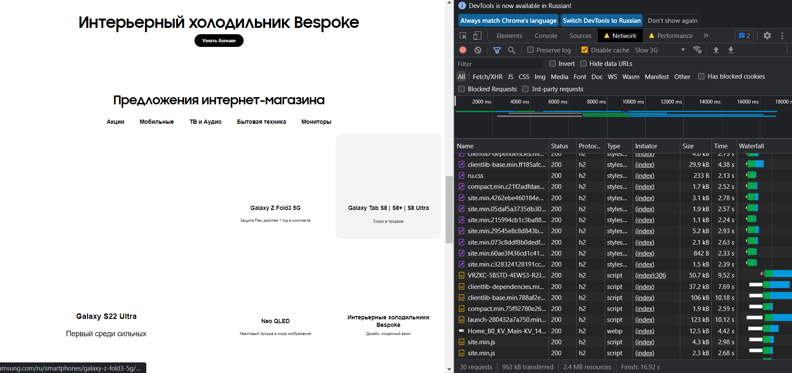

# Производительность сайта (замедление CPU 4x slowdown и эмуляцию сети Slow 3G)

## Network (Ко всему вышеперечисленному, с обычной скоростью сети)

Не видны элементы текста. Т.е. когда страница грузится, в приоритете вот эта картинка, а только потом появляется текст на ней (миганием)



---

В самом начале, первая картинка в слайдере загрузилась и даже закончилось видео. Потом, переключает на второй слайд. И для него, за все прошедшее время, не подгрузился даже placeholder картинки. Из-за этого был белый экран на ее месте. Потом появился placeholder.
И видео тормозит



---

При скроле, отсутствие каких-либо картинок. Может лучше стоит не запрашивать placeholder-ы, а внедрить из в index.html, в формате base64. А когда придет хорошая картинка - заменить. Чтобы не было белого пространства на месте картинок, пока их ждешь




## Performance

* First Paint (FP) - 5775.2 ms
* First Contentful -  Paint (FCP) - 5775.4 ms
* Largest Contentful Paint (LCP) - 10452.4 ms
* DOM Content Loaded (DCL) - 27757.0 ms

LCP происходит на узле ``````

* Loading - 49 ms
* Scripting - 2668 ms
* Rendering - 535 ms
* Painting - 316 ms

## coverage

* CSS - из 519 КБ не используется 429 КБ (т.е. 83%)
* JS - из 2.5 МБ не используется 1.3 МБ (т.е. 52%)
